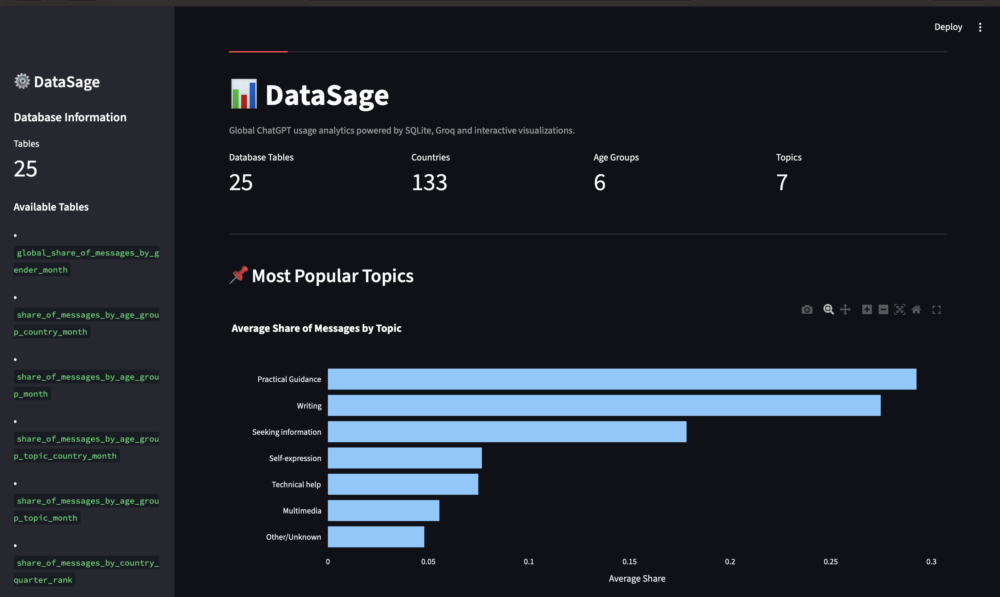
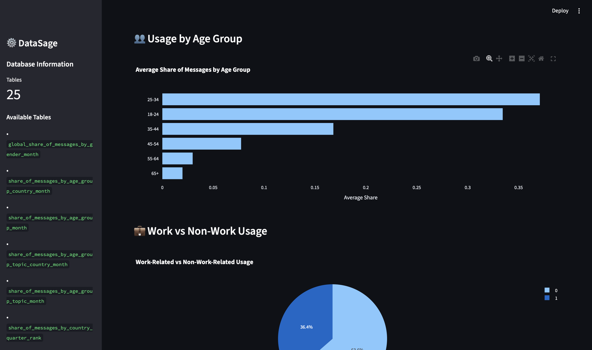
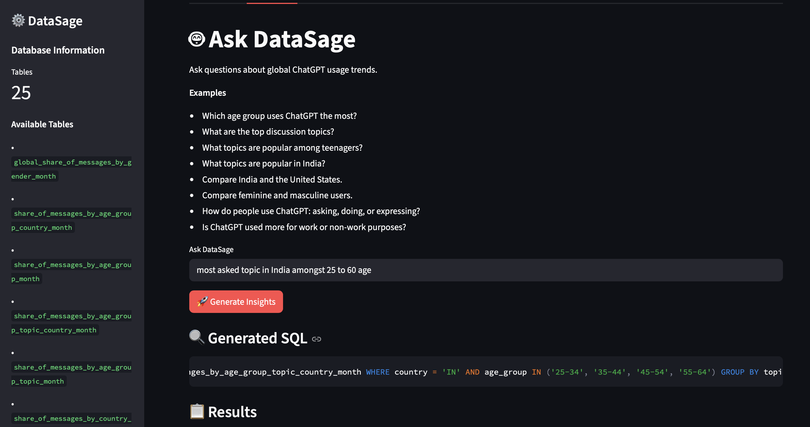
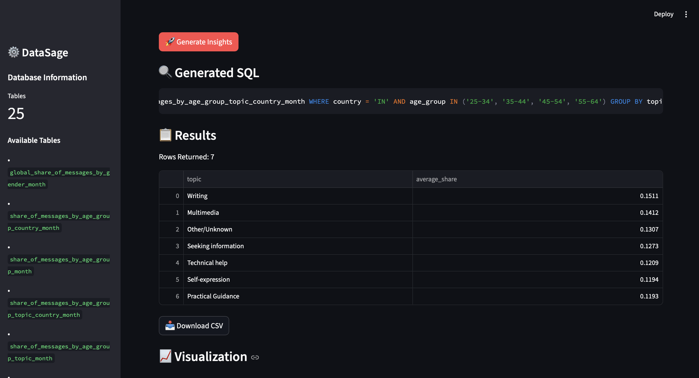
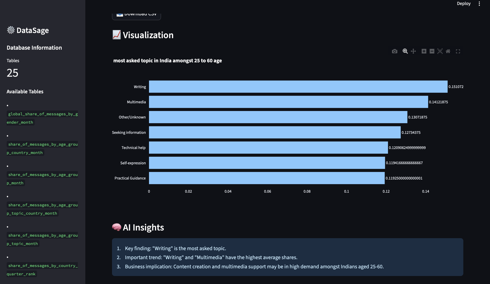

<<<<<<< HEAD
<div align="center">

# 📊 DataSage

### AI-Powered Natural Language Analytics Platform
DataSage enables users to explore structured datasets using natural language. Users can ask questions in plain English, and DataSage automatically converts them into SQL queries, executes them on a SQLite database, generates interactive visualizations, and provides AI-powered business insights.
*Ask questions in plain English. Get SQL, charts, and business insights instantly.*


</div>

---

## 🌟 What is DataSage?

**DataSage** turns plain English questions into live SQL queries, interactive charts, and AI-generated business insights — no SQL knowledge required.

Built on top of global ChatGPT usage data across **133 countries**, **6 age groups**, and **7 topic categories**, DataSage makes data exploration effortless.

---

## 🧩 Skills Demonstrated

`Data Analytics` &nbsp; `SQL` &nbsp; `Natural Language Processing` &nbsp; `Prompt Engineering` &nbsp; `Data Visualization` &nbsp; `Business Intelligence` &nbsp; `Python Development` &nbsp; `LLM Applications`

---

## ✨ Features

| Feature | Description |
|---|---|
| 🤖 **Natural Language → SQL** | Ask questions in plain English; get precise SQL automatically |
| 📈 **Smart Visualizations** | Auto-selects bar, line, or pie charts based on result shape |
| 🧠 **AI Business Insights** | Groq LLM analyzes results and generates key findings |
| 🔒 **SQL Security Layer** | Blocks all destructive queries — only `SELECT` allowed |
| 📥 **CSV Export** | Download any result as a CSV file |
| 🕒 **Query History** | Sidebar tracks your last 10 questions |
| 🛠️ **SQL Debugger** | Run raw SQL directly from the sidebar |

---

## 🏗️ Architecture

```
User Question (Natural Language)
        │
        ▼
  Groq LLM (LLaMA 3.3 70B)
  NL → SQL conversion
        │
        ▼
  SQL Validation Layer
  (blocks unsafe queries)
        │
        ▼
  SQLite Database
        │
        ▼
  Pandas DataFrame
        │
        ├──────► Plotly Visualizations
        │         (Bar / Pie / Line)
        │
        └──────► AI Business Insights
                  (Key finding · Trend · Implication)
```

---

## 🛠️ Tech Stack

| Layer | Technology |
|---|---|
| **Frontend** | Streamlit |
| **LLM** | Groq — LLaMA 3.3 70B Versatile |
| **Database** | SQLite |
| **Data Processing** | Pandas |
| **Visualization** | Plotly Express |
| **DB Access** | SQLAlchemy |
| **Environment** | python-dotenv |

---

## 📂 Project Structure

```
DataSage/
│
├── app.py              ← Main Streamlit application
├── llm.py              ← SQL generation via Groq
├── metadata.py         ← Dataset metadata & prompt context
├── security.py         ← SQL validation layer
├── database_setup.py   ← Loads CSVs into SQLite
├── datasage.db         ← SQLite database
├── requirements.txt
├── .env                ← GROQ_API_KEY (not committed)
└── README.md
```

---

## 📸 Screenshots

### Dashboard



### Natural Language Query


### Generated SQL & Results


### AI Insights


---

## 🔍 Example Questions

```
Which age group uses ChatGPT the most?
What are the most popular topics in India?
Compare work-related and non-work-related usage.
Which countries rank highest in ChatGPT engagement?
Compare India and the United States.
How do people use ChatGPT: asking, doing, or expressing?
What topics are popular among 25–34 year olds?
```

---

## ⚙️ Installation

### 1. Clone the Repository

```bash
git clone https://github.com/yourusername/DataSage.git
cd DataSage
```

### 2. Create Virtual Environment

```bash
python -m venv venv
source venv/bin/activate        # macOS / Linux
venv\Scripts\activate           # Windows
```

### 3. Install Dependencies

```bash
pip install -r requirements.txt
```

### 4. Configure Environment Variables

Create a `.env` file in the project root:

```env
GROQ_API_KEY=your_groq_api_key_here
```

### 5. Set Up Database

```bash
python database_setup.py
```

### 6. Run the App

```bash
streamlit run app.py
```

---

## 📈 Dataset Overview

The current version analyzes **global ChatGPT usage trends**:

- 🌍 **133 Countries**
- 👥 **6 Age Groups** — 18-24, 25-34, 35-44, 45-54, 55-64, 65+
- 📌 **7 Topic Categories** — Practical Guidance, Writing, Seeking Information, Self-expression, Technical Help, Multimedia, Other
- 💼 **Work vs. Non-Work** usage split
- 🗣️ **Ask / Do / Express** interaction types
- ⚧ **Gender** — Feminine vs. Masculine

---

## 🔮 Roadmap

### DataSage V2
- [ ] Multi-dataset support
- [ ] AI Tools Adoption dataset integration
- [ ] Cross-dataset analytics
- [ ] Advanced KPI dashboards

### DataSage V3
- [ ] PostgreSQL backend
- [ ] User authentication
- [ ] Query history persistence
- [ ] Dashboard export to PDF

---

## 🎯 Key Highlights

- Built an **AI-powered Natural Language Analytics Platform** using Groq, SQLite, Streamlit, and Plotly
- Implemented **NL→SQL conversion** with a secure query validation layer
- Generated **dynamic visualizations** and **AI-driven business insights** from live query results
- Enabled analytics across **global ChatGPT usage data** — 133 countries, 6 age groups, 7 topic categories

---

## 👩‍💻 Author

<div align="center">

**Kaashvi Gupta**

B.Tech CSE (Cybersecurity) · MIT World Peace University

</div>


